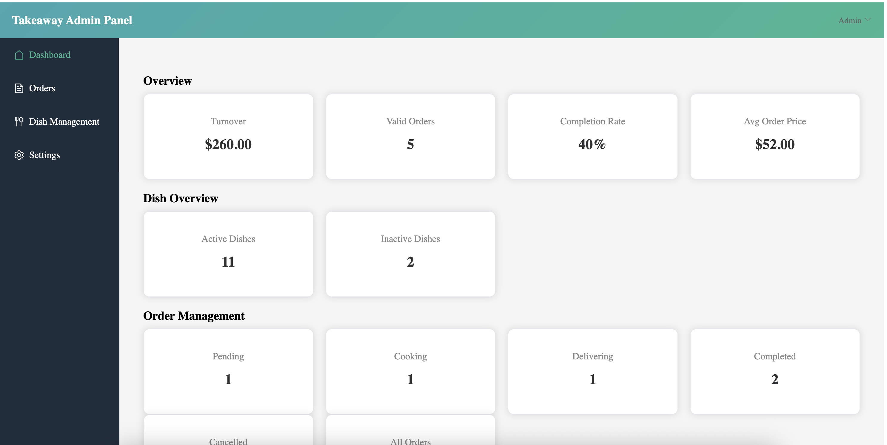
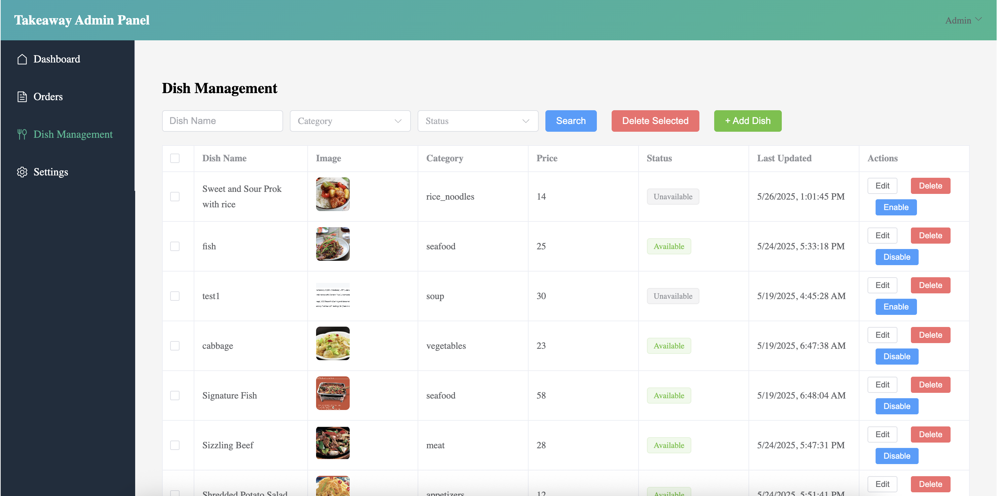
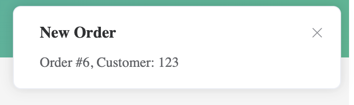
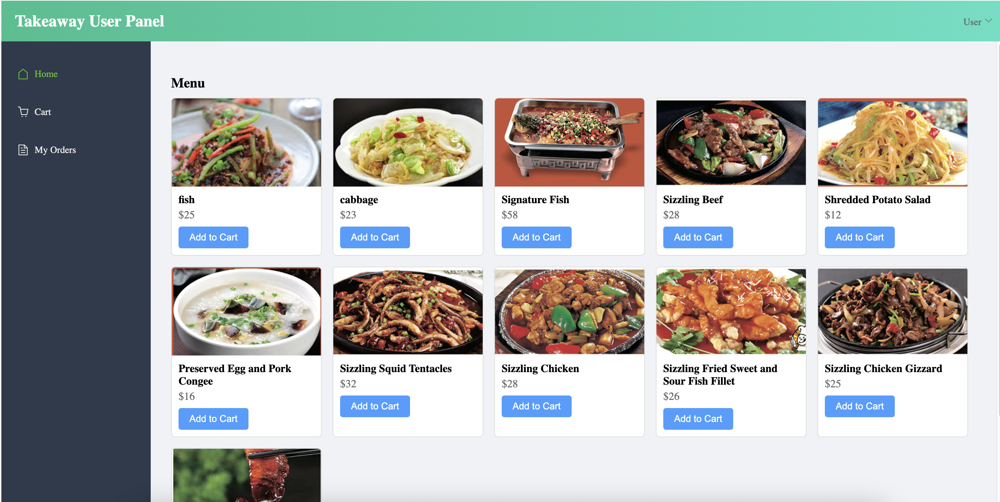

# Takeaway Project

A full-stack takeaway ordering system with an **Admin Panel** and **User Portal**.

---

##  Quick Start

1. **Front-end (Vue 3 + Vite)**  
   ```bash
   cd vue_project
   npm install
   npm run dev
   ```  
   Development server: `http://localhost:5173`  
   - Proxies `/api` and `/ws` to the back-end.

2. **Back-end (Spring Boot)**  
   ```bash
   cd Springboot
   mvn clean package
   mvn spring-boot:run
   ```  
   API server: `http://localhost:8080`

---

##  Features

- **Admin Panel**  
  - Real-time order notifications via WebSocket  
  - Manage orders: accept, cook, deliver, cancel  
  - Dish management: create, edit, enable/disable  
  - Update admin account settings (username & password)

- **User Portal**  
  - Google OAuth2 & form-based login  
  - Browse available dishes by category  
  - Place orders with recipient details  
  - View real-time order status updates

##  Screenshots

<div align="center">
  <br>
  *Admin Panel*<br><br>

  <br>
  *Dish Editing*<br><br>

  <br>
  *Real-time Notification*<br><br>

  <br>
  *User Portal*
</div>